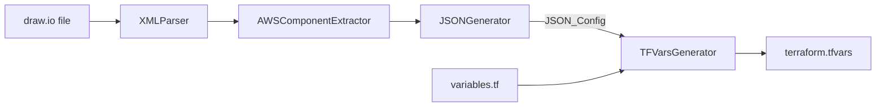

# Design Document: tfvars-generator

## Overview

This feature adds a `TFVarsGenerator` module as the final step in the `drawio-terraform-parser` CLI pipeline. Instead of writing a JSON file to disk, the CLI will now produce a `terraform.tfvars` file by mapping the `JSON_Config` object (produced by `JSONGenerator`) to the variable definitions found in a `variables.tf` template file.

The pipeline becomes:

```
XML parsing → AWS extraction → JSON generation → TFVars generation → terraform.tfvars
```

The intermediate `JSON_Config` is never written to disk; only the `.tfvars` file is the final artifact.

---

## Architecture

### Pipeline Extension

The existing `DrawIOJSONPipeline` in `src/Pipeline.js` and the `DrawIOTerraformCLI` in `bin/cli.js` both orchestrate the three-step pipeline. The new step is appended after JSON generation:



### Module Responsibilities

| Module | Responsibility |
|---|---|
| `src/TFVarsGenerator.js` | Parse `variables.tf`, map `JSON_Config` fields, format HCL output |
| `bin/cli.js` | Accept `--vars-template` arg, call `TFVarsGenerator`, write output file |

---

## Components and Interfaces

### `TFVarsGenerator` class

```js
class TFVarsGenerator {
  // Parse a variables.tf file and return an array of VariableDefinition objects
  async parseVariablesFile(filePath: string): Promise<VariableDefinition[]>

  // Map JSON_Config fields to the parsed variable definitions
  mapConfigToVariables(jsonConfig: object, varDefs: VariableDefinition[]): MappedVariable[]

  // Format a single mapped variable as an HCL assignment string
  formatVariable(mappedVar: MappedVariable): string

  // Generate the full .tfvars content string from a JSON_Config and a variables.tf path
  async generate(jsonConfig: object, varsTemplatePath: string): Promise<GenerateResult>
}
```

### Data Shapes

```js
// A variable block parsed from variables.tf
VariableDefinition {
  name: string,          // e.g. "vpc_cidr"
  type: string | null,   // e.g. "string", "map(object({...}))", "list(string)"
  description: string | null,
  default: any           // parsed default value, or undefined if absent
}

// A variable with its resolved value
MappedVariable {
  name: string,
  type: string | null,
  value: any,            // resolved from JSON_Config or default
  source: 'json_config' | 'default' | 'null',
  warning?: string       // set when source === 'null'
}

// Return value of generate()
GenerateResult {
  content: string,       // full .tfvars file content
  variablesWritten: number,
  warnings: string[]
}
```

### `TFVarsGenerationError` custom error

```js
class TFVarsGenerationError extends Error {
  constructor(type: string, message: string, context?: object)
  // type values: 'FILE_NOT_FOUND', 'PARSE_ERROR', 'MAPPING_ERROR',
  //              'FORMAT_ERROR', 'WRITE_ERROR'
}
```

---

## Data Models

### `variables.tf` parsing

The generator uses a regex-based parser (no external HCL library needed for the read-only, well-structured subset used here). Each `variable` block has the form:

```hcl
variable "vpc_cidr" {
  type        = string
  description = "VPC CIDR block"
  default     = "10.0.0.0/16"
}
```

The parser extracts:
- **name** — from `variable "<name>" {`
- **type** — from the `type` attribute (raw string, e.g. `string`, `map(object({...}))`)
- **description** — from the `description` attribute
- **default** — from the `default` attribute, parsed as a JS value

### JSON_Config → variable mapping

The mapping table (Requirement 3):

| `variables.tf` variable | `JSON_Config` field |
|---|---|
| `project_name` | `json.project_name` |
| `vpc_cidr` | `json.vpc_cidr` |
| `region` | `json.region` |
| `environment` | `json.environment` |
| `subnets` | `json.subnets` |
| `route_tables` | `json.route_tables` |

All other variable names are resolved from their `default` in `variables.tf`, or set to `null` with a warning.

### HCL type formatting rules

| Terraform type | JS value | HCL output |
|---|---|---|
| `string` | `"us-east-1"` | `"us-east-1"` |
| `bool` | `true` | `true` |
| `number` | `42` | `42` |
| `map(...)` / `object(...)` | `{ k: v }` | `{ k = "v" }` indented block |
| `list(...)` / `tuple(...)` | `[a, b]` | `["a", "b"]` |
| unknown / null | `null` | `null` |

Nested objects use 2-space indentation. String values inside maps/lists are always double-quoted.

### Output format example

```hcl
project_name = "paperless"
vpc_cidr     = "10.102.67.0/24"
region       = "us-east-1"
environment  = "dev"

subnets = {
  SUBNET-PRIVADA-RT1-DEV = {
    cidr = "10.102.67.64/27"
    az   = "us-east-1a"
    tags = {
      Name        = "SUBNET-PRIVADA-RT1-DEV"
      Type        = "private_rt"
      Environment = "dev"
    }
  }
}

route_tables = {
  RT-PAPERLESS-ROUTABLE-PRIVATE-1 = {
    routes             = []
    associated_subnets = ["SUBNET-PRIVADA-RT1-DEV", "SUBNET-PRIVADA-RT2-DEV"]
    tags = {
      Name        = "RT-PAPERLESS-ROUTABLE-PRIVATE-1"
      Type        = "private_rt"
      Environment = "dev"
    }
  }
}
```

### CLI argument additions

`bin/cli.js` gains one new argument:

| Argument | Default | Description |
|---|---|---|
| `--vars-template <path>` | `./variables.tf` in CWD | Path to the `variables.tf` template file |

The `--output` flag now points to the `.tfvars` destination instead of a `.json` file.

---


## Correctness Properties

*A property is a characteristic or behavior that should hold true across all valid executions of a system — essentially, a formal statement about what the system should do. Properties serve as the bridge between human-readable specifications and machine-verifiable correctness guarantees.*

### Property 1: Variable resolution

*For any* `JSON_Config` object and `variables.tf` with N variable blocks, every variable in the generated output must use the value from `JSON_Config` when a mapping exists, and the `default` value from `variables.tf` when no mapping exists and a default is defined.

**Validates: Requirements 1.4, 1.5**

---

### Property 2: Field mapping completeness

*For any* valid `JSON_Config` object, the six canonical fields (`project_name`, `vpc_cidr`, `region`, `environment`, `subnets`, `route_tables`) must each appear in the generated `.tfvars` output with values equal to their corresponding `JSON_Config` fields, preserving nested object structure for `subnets` and `route_tables`.

**Validates: Requirements 3.1, 3.2, 3.3, 3.4, 3.5, 3.6**

---

### Property 3: HCL type formatting

*For any* variable with a declared Terraform type, the formatted HCL value must match the expected syntax for that type: `string` values are double-quoted, `bool` and `number` values are unquoted, `map`/`object` values use `{ key = value }` block syntax, and `list`/`tuple` values use `[...]` syntax.

**Validates: Requirements 3.7, 3.8, 3.9, 3.10, 3.11**

---

### Property 4: HCL structural validity

*For any* valid `JSON_Config` object and `variables.tf`, the generated `.tfvars` content must match the pattern `<identifier> = <value>` for every top-level assignment, with no unclosed braces or brackets.

**Validates: Requirements 4.1, 4.2, 4.3, 4.4**

---

### Property 5: Nested indentation

*For any* variable whose value is a nested object or map, every nested key-value pair in the HCL output must be indented by exactly 2 spaces per nesting level relative to its parent block.

**Validates: Requirements 4.5**

---

### Property 6: TFVars generation round-trip

*For any* valid `JSON_Config` object, generating a `.tfvars` string and then re-parsing the assignments from that string must produce a set of variable assignments equivalent to the original mapped values.

**Validates: Requirements 4.6**

---

### Property 7: variables.tf parsing completeness

*For any* valid `variables.tf` content containing N `variable` blocks, parsing must return exactly N `VariableDefinition` objects, each with the correct `name`, `type`, `description`, and `default` fields as declared in the source.

**Validates: Requirements 2.4**

---

### Property 8: variables.tf parse round-trip

*For any* valid `variables.tf` content, parsing the file into `VariableDefinition` objects and then formatting those definitions back into HCL and re-parsing must produce an equivalent set of variable definitions.

**Validates: Requirements 2.6**

---

## Error Handling

| Scenario | Error type | Behavior |
|---|---|---|
| `variables.tf` not found | `FILE_NOT_FOUND` | Exit code 1, descriptive message to stderr |
| `variables.tf` unparseable | `PARSE_ERROR` | Exit code 1, line number + message to stderr |
| Variable has no mapping and no default | `MAPPING_ERROR` (warning) | Continue, write `null`, emit warning to stderr |
| `JSON_Config` has no subnets | warning | Write `subnets = {}`, emit warning to stderr |
| `JSON_Config` has no route tables | warning | Write `route_tables = {}`, emit warning to stderr |
| `variables.tf` has zero variable blocks | warning | Write empty file, emit warning to stderr |
| Output directory does not exist | — | Create parent directories with `mkdir -p` semantics before writing |
| Output file write fails | `WRITE_ERROR` | Exit code 1, filesystem error message to stderr, no partial file written |
| TFVars generation step fails | `TFVarsGenerationError` | CLI catches, exits code 1, no output file written |

All warnings go to `stderr` so they do not pollute the `.tfvars` output when stdout is redirected.

---

## Testing Strategy

### Dual testing approach

Both unit tests and property-based tests are required. Unit tests cover specific examples, integration points, and error conditions. Property tests verify universal correctness across randomly generated inputs.

### Unit tests (`src/__tests__/TFVarsGenerator.test.js`)

- Parsing a `variables.tf` with string, bool, number, map, and list variables returns correct `VariableDefinition` objects
- Parsing a `variables.tf` with a `default` value returns the correct parsed default
- Mapping a known `JSON_Config` (e.g. `arqui-test.json`) produces the expected `.tfvars` content
- A variable with no JSON_Config mapping and no default produces `null` and a warning
- Empty `subnets` in `JSON_Config` produces `subnets = {}` and a warning
- Empty `route_tables` in `JSON_Config` produces `route_tables = {}` and a warning
- A `variables.tf` with zero blocks produces an empty file and a warning
- An invalid `variables.tf` throws `TFVarsGenerationError` with type `PARSE_ERROR`
- A missing `variables.tf` throws `TFVarsGenerationError` with type `FILE_NOT_FOUND`

### Property-based tests (`src/__tests__/TFVarsGenerator.property.test.js`)

Property-based testing library: **fast-check** (already used in the project's existing property tests).

Each property test runs a minimum of **100 iterations**.

Each test is tagged with a comment in the format:
`// Feature: tfvars-generator, Property <N>: <property_text>`

**Property 1 — Variable resolution**
```
// Feature: tfvars-generator, Property 1: Variable resolution
```
Generate random `JSON_Config` objects and random `VariableDefinition` arrays. For each variable in the definitions, assert the output uses the `JSON_Config` value when a mapping exists, and the `default` when it does not.

**Property 2 — Field mapping completeness**
```
// Feature: tfvars-generator, Property 2: Field mapping completeness
```
Generate random valid `JSON_Config` objects (with arbitrary `project_name`, `vpc_cidr`, `region`, `environment`, `subnets`, `route_tables`). Assert all six fields appear in the output with correct values.

**Property 3 — HCL type formatting**
```
// Feature: tfvars-generator, Property 3: HCL type formatting
```
Generate random `(type, value)` pairs for each Terraform type. Assert the formatted string matches the expected HCL syntax for that type (quoted strings, unquoted booleans/numbers, `{...}` for maps, `[...]` for lists).

**Property 4 — HCL structural validity**
```
// Feature: tfvars-generator, Property 4: HCL structural validity
```
Generate random valid `JSON_Config` objects. Assert the generated `.tfvars` string has balanced braces/brackets and every top-level line matches `<identifier> = <value>`.

**Property 5 — Nested indentation**
```
// Feature: tfvars-generator, Property 5: Nested indentation
```
Generate random nested objects. Assert every nested key-value pair in the output is indented by exactly 2 spaces per nesting level.

**Property 6 — TFVars generation round-trip**
```
// Feature: tfvars-generator, Property 6: TFVars generation round-trip
```
Generate random valid `JSON_Config` objects. Generate `.tfvars` content, then parse the assignments back out, and assert the parsed values are equivalent to the originals.

**Property 7 — variables.tf parsing completeness**
```
// Feature: tfvars-generator, Property 7: variables.tf parsing completeness
```
Generate random arrays of `VariableDefinition` objects, format them into a `variables.tf` string, then parse. Assert the count and field values match the originals.

**Property 8 — variables.tf parse round-trip**
```
// Feature: tfvars-generator, Property 8: variables.tf parse round-trip
```
Generate random valid `variables.tf` content strings. Parse → format → parse and assert the resulting definitions are equivalent.
